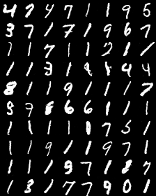
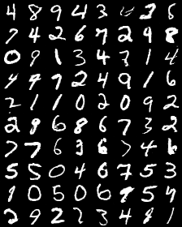

# Minimal-SAN
A minimal Pytorch implementation of a Slicing Adversarial Network by Sony.

- Paper (arxiv) : [SAN: Inducing Metrizability of GAN with Discriminative Normalized Linear Layer](https://arxiv.org/abs/2301.12811)
- Official codes : [StyleSAN-XL](https://github.com/sony/san)

# Summary

This repository provides a simple implementation of class-conditional Slicing Adversarial Network (SAN) which theoretically ensure stability of GANs training.

This repository includes:
* Architecture : DCGAN / DCSAN (Hinge loss based)
* Training codes with MNIST dataset

Let's boost your GANs application by using SAN.

# Requirements
- Python 3.8.5
- pytorch 1.6.0
- torchvision 0.7.0
- tensorboard 2.3.0
- tqdm 4.50.2

# Training

## 1) Hyperparameters
Specify hyperparameters inside a .json file, e.g.:

```json
{
    "dim_latent": 100,
    "batch_size": 64,
    "learning_rate": 0.0002,
    "beta_1": 0.5,
    "beta_2": 0.999,
    "num_epochs": 200
}
```


## 2) Train the model

```bash
python train_gan.py --datadir <path_to_mnist> --model 'san'
```

<!-- <details>
<summary>Other options</summary> -->
```
options:
  -h, --help
    show this help message and exit<br>
  --datadir DATADIR
    path to MNIST dataset folder
  --params PARAMS
    path to hyperparameters
  --model MODEL
    model's name / 'gan' or 'san'
  --disable_class
    disable class conditioning
  --logdir LOGDIR
    directory storing log files
  --device DEVICE
    gpu device to use
  --num_samples_per_class NUM_SAMPLES_PER_CLASS
    number of samples to generate during test
  --jobname JOBNAME
    job/directory name used for tensorboard outputs
```
</details>

# Results

In the case of GANs, there is a tendency for the discriminator to become too strong, hindering effective learning of the generator, which results in reduced diversity in the generated images. However, in the case of SAN, both components are balanced in their learning, leading to the generation of diverse images.

## Generated images (after 200 epochs)

### Unconditional

GAN         |  SAN
:-------------------------:|:-------------------------:
  |  

### Class conditional

GAN          |  SAN
:-------------------------:|:-------------------------:
  |  


## Training curve

GAN
- Light blue: no cond
- Blue: class cond


SAN
- Red: no cond
- Orange: class cond


# Citation
[1] Takida, Y., Imaizumi, M., Shibuya, T., Lai, C., Uesaka, T., Murata, N. and Mitsufuji, Y.,
"SAN: Inducing Metrizability of GAN with Discriminative Normalized Linear Layer,"
Preprint.
```
@ARTICLE{takida2023san,
    author={Takida, Yuhta and Imaizumi, Masaaki and Shibuya, Takashi and Lai, Chieh-Hsin and Uesaka, Toshimitsu and Murata, Naoki and Mitsufuji, Yuki},
    title={{SAN}: Inducing Metrizability of GAN with Discriminative Normalized Linear Layer},
    journal={Computing Research Repository},
    volume={arXiv:2301.12811},
    year={2023},
    url={https://arxiv.org/abs/2301.12811},
    }
```